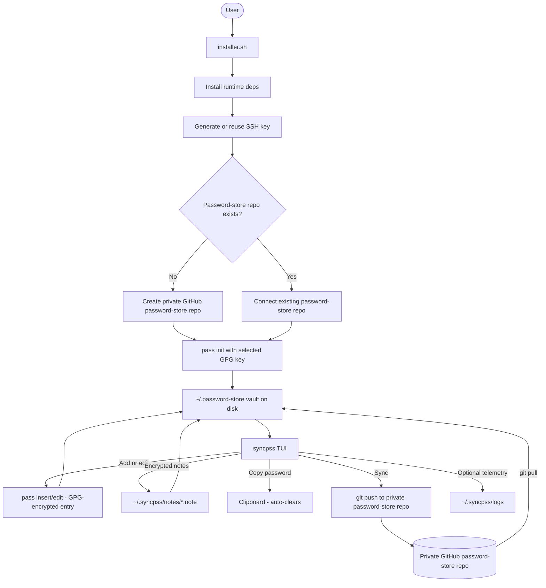
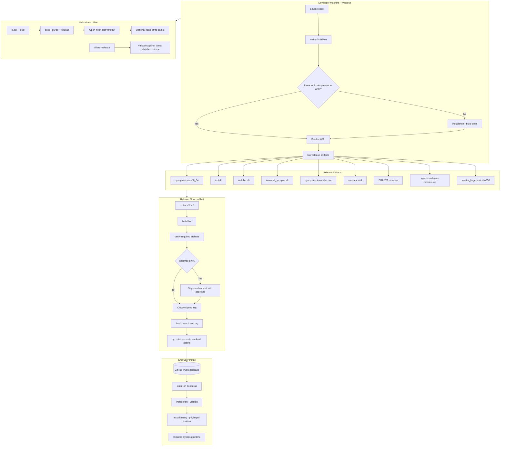

# syncpss Pass Manager

> **syncpss** — the free, easy, secure way to store your passwords.

A Linux/WSL password manager TUI built around the open-source `pass` CLI. It keeps your vault in the standard `~/.password-store` layout, gives you a friendly terminal UI for everyday password management, and syncs that store to your private GitHub password-store repo.

---

## At a Glance

| | |
|---|---|
| **Free** | No custom vault format, no lock-in |
| **Easy** | One installer flow for Linux, WSL, and Windows |
| **Secure** | Standard `pass`, signed release tags, verified assets, telemetry off by default |

---

## Password Store System Flow

How your secrets move from install to encrypted vault and back:



---

## Developer Build & Release Pipeline

How a code change becomes a published release:



---

## Release Artifacts

| Artifact | Purpose |
|---|---|
| `syncpss-linux-x86_64` | Main Linux/WSL TUI binary |
| `install` | Linux privileged finalizer for `/usr/local/bin`, `/etc/syncpass`, and synced runtime config |
| `installer.sh` | Linux/WSL setup wizard |
| `uninstall_syncpss.sh` | Linux/WSL uninstall helper |
| `syncpss-wsl-installer.exe` | Windows helper that bootstraps WSL, stages release assets, and launches the Linux installer |
| `manifest.xml` | Release manifest describing the published asset set |
| `master_fingerprint.sha256` | Runtime verification fingerprint staged into `~/.syncpss/config/` |
| `syncpss-release-binaries.zip` | Convenience zip bundle of the main binaries/helpers |

The `.sha256` files remain intentional. They are still used by the installer and update flow to verify downloaded assets. The release flow also creates detached `.asc` signatures for the main downloadable assets, while the Git tag itself is GPG-signed for GitHub verification.

---

## Installation

### Linux or WSL

```sh
curl -fsSL https://raw.githubusercontent.com/KffeePt/syncpss/main/install.sh | bash
```

The bootstrap pulls the selected published `installer.sh` release asset, verifies it, stages it into your home directory, and runs it. By default it uses the latest production release. To pin a specific release:

```sh
SYNCPSS_RELEASE_TAG=vX.Y.Z curl -fsSL https://raw.githubusercontent.com/KffeePt/syncpss/main/install.sh | bash
```

### Windows to WSL

Run `syncpss-wsl-installer.exe` from Windows. It:

1. Detects Windows-side dependencies like `git` and `gh` and offers to install them with `winget`
2. Enables WSL when needed
3. If no distro is installed yet, offers to install Ubuntu or Kali and opens a second terminal for first-run setup
4. Lets you choose the target WSL distro and Linux user
5. Prepares the Windows runtime helper under `%USERPROFILE%\.syncpss`
6. Copies release helpers into `~/.syncpss/helpers/`
7. Stages `master_fingerprint.sha256` into `~/.syncpss/config/`
8. Generates the Start Menu icon from `assets/icon.svg`
9. Creates a Start Menu shortcut that launches the WSL TUI directly
10. Can open a WSL terminal and run `bash ~/.syncpss/helpers/installer.sh` automatically

To bootstrap the Linux build toolchain for local Windows-driven builds:

```sh
bash ~/.syncpss/helpers/installer.sh --build-deps
```

---

## What `installer.sh` Does

Inside Linux/WSL, the script:

1. Installs runtime dependencies for `syncpss`
2. Fetches verified release assets from the public GitHub release channel
3. Prompts for optional Git `user.name` and `user.email`
4. Reuses or generates an SSH key and copies the public key to the clipboard
5. Verifies GitHub's pinned host key before trusting SSH bootstrap
6. Detects install health and offers `Install`, `Repair`, `Reinstall/Update`, or `Uninstall`
7. Creates or connects the private password-store repo
8. Restores or backs up the encrypted `keys` container as needed
9. Reuses or prepares the active GPG key and runs `pass init`
10. Initializes `~/.password-store`, writes `manifest.xml`, and prepares repo metadata
11. Writes the store hash file and pushes the initial private-store state when needed
12. Downloads the released `install` binary and uninstall helper, verifies them, and runs the privileged finalizer with `sudo`
13. Uses `gh` auth only for private password-store bootstrap, not for downloading the public app release

---

## Why the `install` Binary Still Exists

The Linux `install` binary isolates the privileged final step from the larger interactive shell wizard. It handles:

- installing `syncpss` into `/usr/local/bin/syncpss`
- creating `/usr/local/bin/syncpass`
- writing `/etc/syncpass/config`
- writing `~/.syncpss/config.json`
- pointing both configs at the same `pass` store in `~/.password-store`
- writing encrypted-note settings into `~/.syncpss/config.json`
- staging runtime verification state like `master_fingerprint.sha256`

This keeps the `sudo`-required filesystem changes in one smaller audited unit instead of spreading them through the larger shell wizard.

---

## Local Builds

### Build Everything

From Windows:

```bat
scripts\build.bat
```

This produces the full local release-prep set in `bin\`:

```text
bin\syncpss-linux-x86_64
bin\syncpss-linux-x86_64.sha256
bin\manifest.xml
bin\manifest.xml.sha256
bin\install
bin\install.sha256
bin\master_fingerprint.sha256
bin\syncpss-wsl-installer.exe
bin\syncpss-wsl-installer.exe.sha256
bin\installer.sh
bin\installer.sh.sha256
bin\uninstall_syncpss.sh
bin\uninstall_syncpss.sh.sha256
bin\syncpss-release-binaries.zip
bin\syncpss-icon.svg
bin\syncpss-icon.png
bin\syncpss-icon.ico
```

The compile cache and build tree live in a temporary Windows cache directory, not in the repo. Only the release-ready artifacts are written into `bin\`.

If the selected WSL distro is missing the Linux build toolchain, `build.bat` bootstraps it automatically through `scripts/sh/installer.sh --build-deps`. That installs only the build toolchain and runs only when the tools are actually missing.

### Targeted Build Modes

| Command | Effect |
|---|---|
| `scripts\build.bat --tui-only` | Builds only the Linux `syncpss` TUI artifact |
| `scripts\build.bat --installer-only` | Builds only the installer-side artifacts |
| `scripts\build.bat --installer-only --skip-linux-installer` | Builds only the Windows `.exe` plus helper scripts |
| `scripts\update_icon.bat` | Regenerates the Windows icon assets from `assets\icon.svg` without a full build |

### CI / Validation

| Command | Effect |
|---|---|
| `scripts\ci.bat --local` | Build, purge, reinstall, open a fresh test window, then optionally hand off to `cd.bat` |
| `scripts\ci.bat --release` | Same flow, but forces the installer to use the latest published GitHub release |

---

## Releasing

From Windows:

```bat
scripts\cd.bat 1.2.3
```

The release flow:

1. Runs `scripts\build.bat`
2. Verifies required release assets exist in `bin\`
3. Stages and commits if the worktree is dirty and you approve it
4. Creates a GPG-signed release tag
5. Pushes the current branch and tag
6. Uploads release assets with `gh release create`

> GitHub Actions do not publish releases. Pull request checks still run, but publishing is local-only through `cd.bat`.

If the maintainer ID is missing, the release flow can initialize it from `config\maintainer_id.sha256`. You can also manage it directly with:

```bat
scripts\set_fingerprint.bat
```

```sh
bash scripts/sh/set_fingerprint.sh
```

---

## Running syncpss

After install, either command launches the TUI:

```sh
syncpss
```

```sh
syncpass
```

The TUI includes:

- a skippable startup donut splash
- timed clipboard notices that auto-return after a short delay
- an integrated password-store manager
- `Configuration > Uninstall`
- key backup, restore, and GPG management under `Configuration`

---

## Uninstall

From Windows:

```bat
scripts\purge.bat
```

Inside Linux/WSL:

```sh
bash ~/.syncpss/helpers/uninstall_syncpss.sh
```

This removes installed binaries, config, and runtime data. It can also optionally remove `~/.password-store` and `~/.gnupg`.

---

## Deprecated Commands

The following legacy commands are deprecated:

| Deprecated | Replaced By |
|---|---|
| `clnpss` | `syncpss-wsl-installer.exe` / `installer.sh` |
| `purgepss` | `scripts\purge.bat` / `uninstall_syncpss.sh` |
| old standalone sync helper | `syncpss`, `syncpass`, and the current installer flow |

---

## Documentation

Full project docs live in [docs/README.md](docs/README.md).

---

*You're the gods of secrets now — good luck.*
